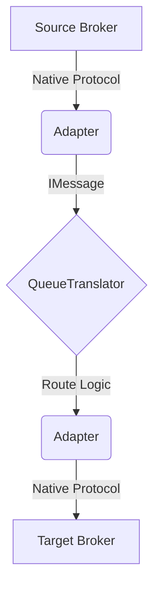

# 🏗️ Architecture: One-Q-4-All

This document details the internal architecture of **One-Q-4-All**, a universal, zero-dependency queue translator built for extreme performance.

## 🏛️ High-Level Design

The system follows a modular, adapter-based architecture. The core logic is decoupled from specific broker implementations through a unified interface.

---

## 🔌 1. Native TCP & Wire Protocols

The main differentiator of @purecore projects is the **"Pure Core"** philosophy. We do not use wrapper libraries (like `node-redis` or `kafkajs`). Instead, we communicate directly with the brokers using **Native TCP Sockets**.

### Why TCP?
- **Zero Overhead**: No intermediate layers between the application and the network stream.
- **Resource Control**: Direct manipulation of backpressure and flow control.
- **Dependency-Free**: Eliminates the risk of supply chain attacks and version conflicts.

---

## 🚀 2. The RESP Parser (Redis Native)

For the Redis adapter, we implemented a custom parser for the **RESP (Redis Serialization Protocol)**. 

### Implementation Details:
- **Stream Reconstruction**: TCP data can arrive in chunks (fragmentation). The `RespParser` uses an internal buffer to accumulate chunks until a full RESP command is ready.
- **State Machine**: It recursively parses the five main RESP types:
    1. `+` (Simple Strings)
    2. `-` (Errors)
    3. `:` (Integers)
    4. `$` (Bulk Strings)
    5. `*` (Arrays)
- **Complexity**: O(n), where n is the size of the data stream. It performs zero unnecessary copies, utilizing slices and native string/buffer methods.

---

## 🛠️ 3. Protocol Stubs & Roadmap

To ensure the library remains lightweight yet extensible, we use a **Stub Pattern** for protocols currently under development.

### Kafka (Native Binary Protocol)
- **Status**: Stub.
- **Approach**: Implementation of the Kafka Wire Protocol (Binary). It involves mapping request/response headers and API keys (Metadata, Produce, Fetch) directly into binary buffers.

### NATS (Simple Text Protocol)
- **Status**: Stub.
- **Approach**: Implementation of the NATS text-based protocol. It is highly efficient and uses simple commands like `PUB`, `SUB`, and `MSG`.

### RabbitMQ (AMQP 0-9-1)
- **Status**: Stub.
- **Approach**: Implementation of the AMQP state machine, involving frame management (Method, Content Header, Content Body).

---

## 🔄 4. Event Hub & Routing

The `QueueTranslator` serves as the central hub. It listens for `message` events from registered adapters and matches them against pre-defined routes.

- **Non-Blocking**: Routing is asynchronous.
- **Auto-Subscription**: When a route is added, the translator automatically instructs the source adapter to subscribe to the required topic.
- **Error Handling**: Implements an ACK/NACK flow. If a target publication fails, the original message can be requeued (NACK).

---
*Document Version: 1.0.0*
*Author: Antigravity Agent*
